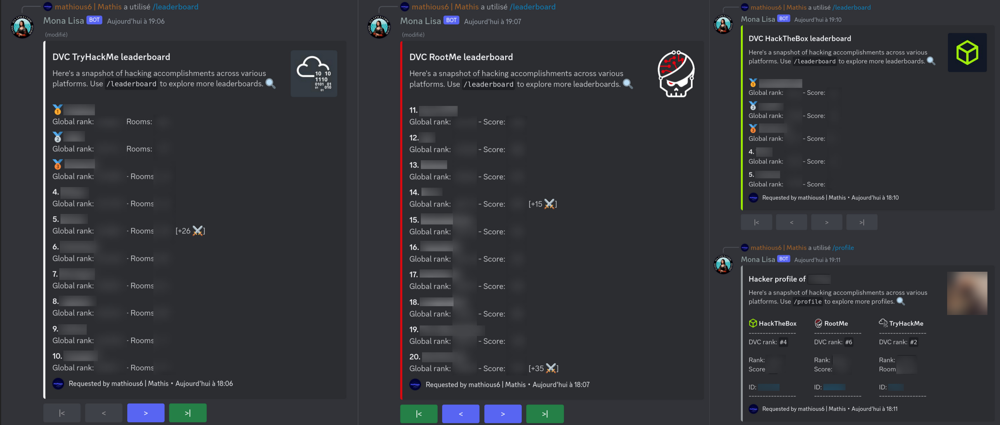

# Discord Hacker Ranker bot

Discord bot using `py-cord` and slash commands to follow the ranking of a guild
on [Hack The Box](https://www.hackthebox.eu/), [Root Me](https://www.root-me.org/)
and [Try Hack Me](https://tryhackme.com/) built by [@mathious6](https://github.com/Mathious6)
for [DaVinciCode](https://github.com/DaVinciCodeCTF).

### Preview



***

## Usage

| Command                                          | Action                                                                |
|:-------------------------------------------------|:----------------------------------------------------------------------|
| `/help`                                          | Display the help message.                                             |
| `/register <pseudo>`                             | Register the author of the command with the given pseudo.             |
| `/update <?pseudo> <?htb_id> <?rm_id> <?thm_id>` | Update the author of the command with the given pseudo and ids.       |
| `/profile <?pseudo>`                             | Display the profile of the author of the command or the given pseudo. |
| `/leaderboard <platform>`                        | Display the leaderboard of the organization on the given platform.    |

## Retrieve platform ids

### Hack The Box ID

1. Sign in to [Hack The Box](https://app.hackthebox.com/login).
2. Go to your [profile overview](https://app.hackthebox.com/profile/overview).
3. Next to your profile picture, on the top, you will see your id after your username: `USERNAME #ID`. Use it to update
   your profile through the bot.

### Root Me UID

1. Sign in to [Root Me](https://www.root-me.org/).
2. Go to your [profile overview](https://www.root-me.org/?page=preferences&lang=en).
3. Under `Modify my parameters` you will see the UID field. Use it to update your profile through the bot.

### Try Hack Me USERNAME

1. Sign in to [Try Hack Me](https://tryhackme.com/login).
2. Go to your [profile overview](https://tryhackme.com/profile).
3. You will see the `username` field. Use it to update your profile through the bot.

## Setup the environment

Create a `.env` file with the following variables in the root of the project:

```
DISCORD_TOKEN=discord_token
RM_API_KEY=root_me_api_key

DISCORD_GUILD_ID=guild_id
DISCORD_CHANNEL_ID=[channel_id1, channel_id2, ...]
ORGANIZATION_NAME=organization_name
DATABASE_PATH=database_path
UPDATE_INTERVAL=update_interval

VAULT_TOKEN=vault_token
VAULT_URL=vault_url

DEV_MODE=dev_mode
DEV_DISCORD_GUILD_ID=dev_guild_id
DEV_DISCORD_CHANNEL_ID=[dev_channel_id1, dev_channel_id2, ...]
DEV_DISCORD_TOKEN=dev_discord_token
```

1. `DISCORD_TOKEN`: Discord bot token, you can get one [here](https://discord.com/developers/applications). **Be careful
   to not share it.**
2. `RM_API_KEY`: Root Me API key, you can get one [here](https://www.root-me.org/?page=preferences&inc=infos).
3. `DISCORD_GUILD_ID`: Discord guild id, you can get it by activating the developer mode in Discord and right-clicking
   on the guild.
4. `DISCORD_CHANNEL_ID`: Discord channel id, you can get it by activating the developer mode in Discord and
   right-clicking on the channel.
5. `ORGANIZATION_NAME`: Will be the name displayed on the embeds.
6. `DATABASE_PATH`: Path to the database file, will be created if it doesn't exist.
7. `UPDATE_INTERVAL`: Interval in minutes between each update of the leaderboard. (Suggestion: 240)

**Optional:**

If you want to use Vault to store the tokens, you will need to set up the following variables.
In this case, the DISCORD_TOKEN & RM_API_KEY variables will be ignored.

7. `VAULT_TOKEN`: Vault token, you can get one [here](https://vaultproject.io/).
8. `VAULT_URL`: Vault url, you can get one [here](https://vaultproject.io/).

**Development:**

If you want to run the bot in development mode, you will need to set up the following variables.
Instead of running the bot on the main guild, it will run on the development guild.

9. `DEV_MODE`: Set to `True` to run the bot in development mode (default: `False`).
10. `DEV_DISCORD_GUILD_ID`: Discord guild id, you can get it by activating the developer mode in Discord and
    right-clicking on the guild.
11. `DEV_DISCORD_CHANNEL_ID`: Discord channel id, you can get it by activating the developer mode in Discord and
    right-clicking on the channel.
12. `DEV_DISCORD_TOKEN`: Discord bot token, you can get one [here](https://discord.com/developers/applications). **Be
    careful to not share it.**

## Local development

To run the bot locally, you will need to follow the steps below:

1. Set up the environment variables in a `.env` file as described above.
2. Install a virtual environment following those steps:
    - ``pip install virtualenv``
    - ``virtualenv -p python3 venv``
    - ``source venv/bin/activate``
3. Once the virtual environment is activated, install the dependencies:
    - ``pip install -r requirements.txt``
4. Run the bot:
    - ``python main.py``

## Deployment

The bot is deployed with [Docker](https://www.docker.com/). To deploy the bot, you will need to follow the steps below:

1. Set up the environment variables in a `.env` file as described above.
2. Build the image:
    - ``docker build -t Dockerfile .``
3. Run the container:
    - ``docker run -d --name discord-hacker-ranker-bot Dockerfile``
4. Stop the container:
    - ``docker stop discord-hacker-ranker-bot``

## Structure

```
├── bot
│   ├── core.py : Main file of the bot, contains the slash commands and initialization.
│   ├── embed_creation.py : Contains the functions to create the embeds to provide a good user experience.
│   └── pagination_view.py : Contains the functions to create the pagination view of the leaderboard.
├── database
│   ├── crud_data.py : Contains the functions to interact with the DailyData table.
│   ├── crud_user.py : Contains the functions to interact with the User table.
│   ├── manager.py : Contains the functions to interact with the database and to manage it.
│   └── models.py : Contains the models of the database.
├── resources : Contains the resources used by the bot like the logos, emojis, etc.
│   ├── HTB_logo.png
│   ├── RM_logo.png
│   └── THM_logo.png
├── utils
│   ├── api.py : Contains the functions to interact with the platforms APIs.
│   ├── env_checker.py : Contains the functions to check the environment variables.
│   ├── ressources.py : Contains the functions to get the resources.
│   └── services.py : Contains the functions to interact with the services.
├── database.db
├── docker-compose.yml
├── Dockerfile
├── logging.conf : Configuration file for the logger.
├── main.py : Main file of the bot, contains initialization and run.
├── README.md
└── requirements.txt
```